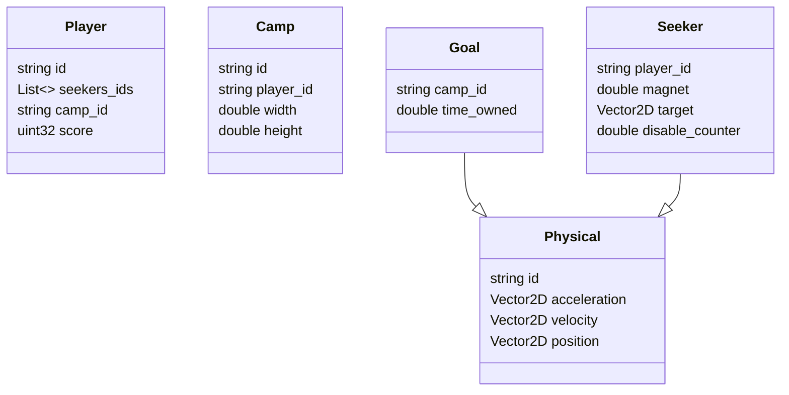
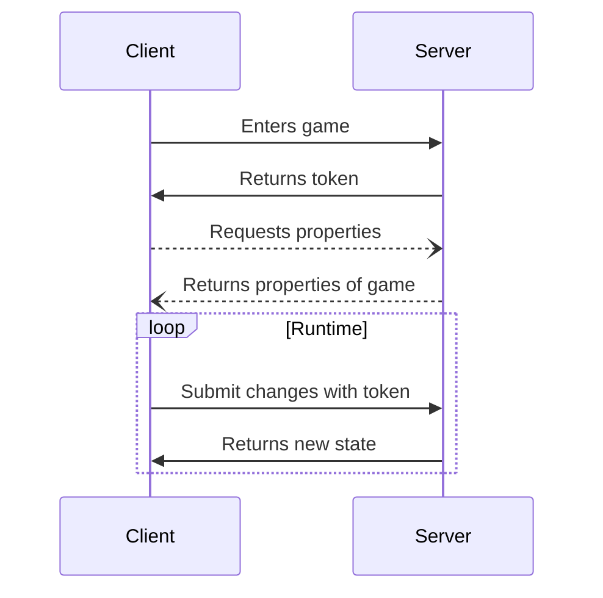

<h1 align=center>Seekers gRPC</h1>

	
	
    
	
    
    
    

Seekers gRPC is a repository that provides a gRPC-based communication interface for the Seekers application. It enables efficient and reliable communication between clients and servers using the gRPC framework.

## Messages

## Services

## Contributing

Contributions to Seekers gRPC are welcome! If you want to contribute, please follow these guidelines:

1. Fork the repository and clone it locally.
2. Create a new branch for your feature or bug fix.
3. Make your changes and ensure that the code compiles without any errors.
4. Commit your changes and push them to your forked repository and submit a pull request. Please provide a short explanation of your changes in the pull request.
5. We will review your changes and merge your request!

Please make sure to follow the project's coding style, guidelines, and standards.

## License

This project is licensed under the GNU General Public License v3.0.
